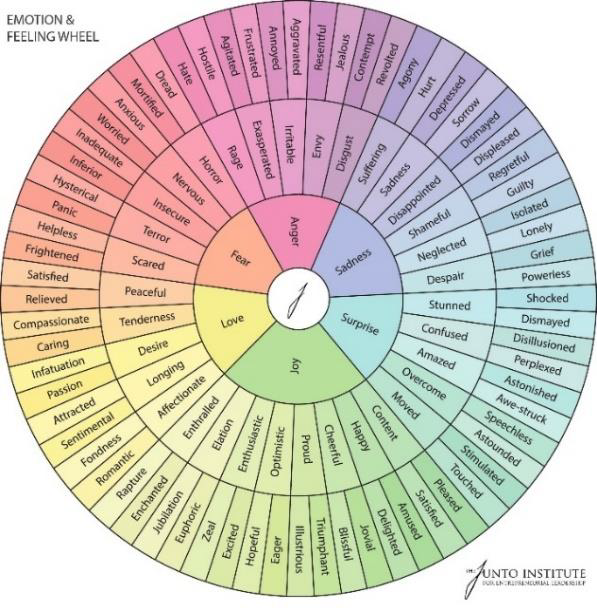
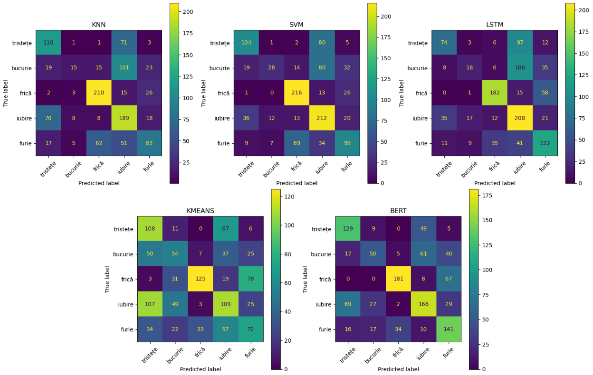

# Song Emotion Analysis

Music recommendation systems increasingly rely on Natural Language Processing (NLP) to understand the emotional content of lyrics. This project explores multi-class emotion classification for song lyrics by predicting the dominant emotion expressed in a song.

The work was developed as a Bachelor's Thesis at the **University of Bucharest, Faculty of Mathematics and Computer Science**.

---

## Overview

Unlike traditional sentiment analysis, which focuses on positive, negative, or neutral polarity, this project performs **emotion classification** across five categories:

* Joy
* Love
* Sadness
* Fear
* Anger

A custom dataset was created specifically for this task, combining information collected from online sources and music streaming data.

<p align="center">
  
  <p align="center">1.Emotion wheel</p>
</p>

---

## Dataset

Since no suitable public dataset was available for this problem, a dedicated dataset was built through web crawling and lyric collection.

### Dataset characteristics

* 16,900 collected songs
* 11,800 unique songs after duplicate removal
* English lyrics only
* Multiple music genres
* Five manually validated emotion classes

The labeling process combines human interpretation with labeling generated by recommendation systems.

---

## Preprocessing

Several preprocessing techniques were evaluated to improve classification quality:

* Text normalization
* Unicode cleanup
* Emoji and symbol handling
* Pattern replacement
* Chorus normalization
* Stemming

The experiments showed that lightweight preprocessing combined with stemming provides the most consistent improvements.

---

## Models Evaluated

The project compares both classical machine learning methods and deep learning approaches.

### Traditional Machine Learning

* Support Vector Machine (SVM)
* K-Nearest Neighbors (KNN)

### Neural Networks

* LSTM

### Unsupervised Learning

* KMeans Clustering

### Transformers

* BERT (`bert-base-uncased`)

---

## Results

| Model  | Validation Accuracy |
| ------ | ------------------- |
| KNN    | 0.541               |
| SVM    | 0.582               |
| LSTM   | 0.552               |
| KMeans | 0.420               |
| BERT   | **0.617**           |

The Transformer-based approach achieved the best overall performance, showing a stronger ability to capture semantic nuances that are common in song lyrics.

<p align="center">
  
  <p align="center">2.Confusion matrices for error distribution</p>
</p>

---

## Observations

Music is inherently ambiguous because lyrics only tell half the story. While standard text models focus entirely on vocabulary, the true feeling of a song depends heavily on its background music. A line of text that reads as happy on paper can instantly shift to a feeling of deep sadness, irony, or anger depending entirely on the arrangement, tempo, instrumentation, and key of the musical backing track.

---

## Project Pipeline

```text
Lyric Extraction -> Build Dataset -> Text Preprocessing -> Feature Representation -> Model Training -> Evaluation and Error Analysis
```

---

## Future Improvements

* Larger and more balanced datasets
* Multilingual lyric support
* Audio feature integration
* Multimodal emotion recognition
* Advanced Transformer architectures

---

## Thesis

**Song Emotion Analysis**
Bachelor's Thesis

**Author:** Cristian Gabriel Cazacu  
**Supervisor:** Conf. Dr. Liviu Petrișor Dinu  
**University of Bucharest**  
**Faculty of Mathematics and Computer Science**  

---

## License

This repository is intended for research and educational purposes.
